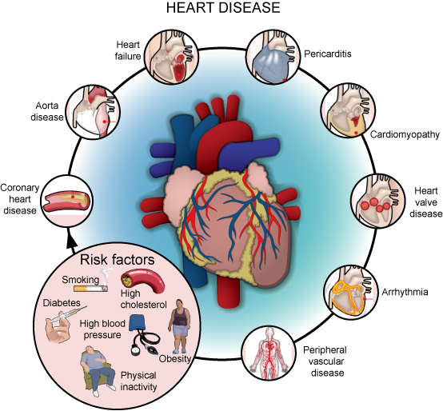

# Cardiovascular Disease App

Cardiovascular Disease

Cardiovascular disease or CVD for short is defined as a group of conditions that involve the heart and blood vessels. When one hears cardiovascular disease, they think of complications like heart attacks, strokes, or angina which is a form of chest pain. Health experts have stated that in the US 1 person dies every 37 seconds from cardiovascular disease and the number of lives lost will increase annually without intervention.

According to the American Heart Association, as of 2019, cardiovascular disease was the number one cause of death in the U.S.

Problem statement: Classify patients as healthy or suffering from cardiovascular disease based on the attributes within the dataset.

